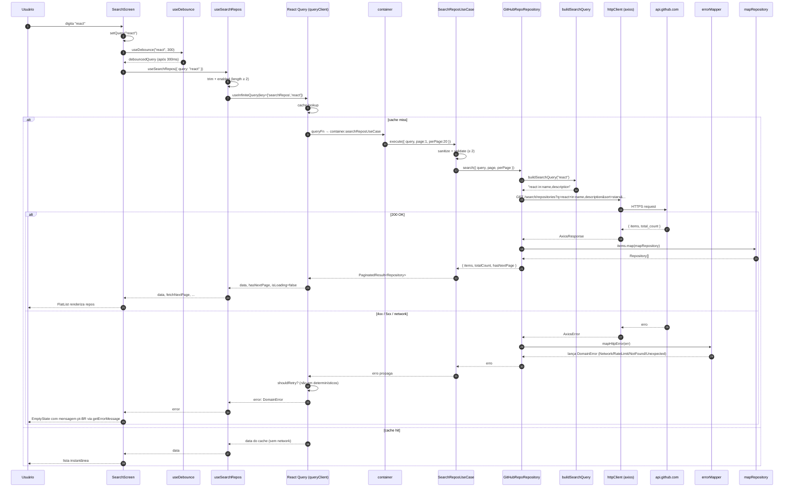

# GitHub Explorer — Documento de Acompanhamento do Projeto

> Documento didático que explica **o que já está implementado**, **por que cada
> peça existe** e **o que ainda falta** para fechar o projeto seguindo Clean
> Architecture. Pensado para quem chega no repo agora e precisa entender em
> profundidade — escrito como aula, não como release notes.

---

## 1. Visão geral do projeto

Aplicativo mobile (Expo SDK 54 + React Native 0.81) que consome a API pública
do GitHub para:

1. **Explorar** — buscar repositórios por termo (com paginação e debounce).
2. **Detalhar** — ver estatísticas de um repositório (estrelas, forks,
   watchers, linguagem, contagem real de issues abertas).
3. **Issues** — listar issues abertas reais (sem misturar pull requests).
4. **Perfil** — tela "Me" com avatar, bio, stats, contribuições e commits
   recentes do usuário configurado em `EXPO_PUBLIC_PROFILE_USERNAME`.

A meta arquitetural é separar o app em **quatro camadas concêntricas** seguindo
Clean Architecture: `domain → application → infrastructure → presentation`.
Cada camada só pode importar de camadas mais internas (regra travada por
`eslint-plugin-boundaries`).

> Nota de naming: a pasta `infrastructure/` foi renomeada para `infra/` (mesmo
> conceito, menos digitação). O alias TypeScript `@/infrastructure/*` continua
> mapeado, e parte dos imports já foi normalizada para `src/infra/...`.

---

## 2. Stack escolhida (e por quê)

| Camada            | Tecnologia                          | Motivo                                                                    |
| ----------------- | ----------------------------------- | ------------------------------------------------------------------------- |
| Build / Runtime   | Expo SDK 54 (New Architecture)      | DX rápida, OTA via Expo Go, suporte à nova arch nativa do RN              |
| UI                | React Native 0.81 + React 19        | Compatível com SDK 54                                                     |
| Linguagem         | TypeScript 5.9 (`strict`)           | Erros em tempo de compilação, narrowing forte em entidades de domínio     |
| Navegação         | `@react-navigation` v7              | Padrão de mercado; tabs + native-stack                                    |
| Tema / Estilo     | `@shopify/restyle` v2               | Theming tipado em cima do StyleSheet; tokens semânticos                   |
| Data fetching     | `@tanstack/react-query` v5          | Cache, retry, paginação infinita, dedupe sem precisar de Redux            |
| HTTP              | `axios` v1                          | Interceptors limpos, error shape consistente                              |
| Datas             | `date-fns`                          | Modular (tree-shake), locale `pt-BR` plug-and-play                        |
| Ícones            | `lucide-react-native`               | SVG tree-shakeable, integra com `react-native-svg`                        |
| Lint              | ESLint 9 flat config + `boundaries` | Enforcement de Clean Architecture em CI/IDE                               |
| Testes            | Jest + `jest-expo` + RNTL           | Preset Expo já alinhado a SDK; React Native Testing Library para UI       |
| Debug             | Reactotron                          | Painel de requests/state em dev                                           |
| Persistência leve | `AsyncStorage`                      | Preferência de tema                                                       |

---

## 3. Estrutura de pastas (cada camada explicada)

```
src/
├── domain/             # núcleo puro. Zero dependências externas.
│   ├── entities/       # Repository, Issue, Owner, Label, UserProfile, RecentCommit
│   ├── repositories/   # contratos: IRepoRepository, IIssueRepository, IUserRepository
│   └── errors/         # DomainError + subclasses (RateLimit, NotFound, etc.)
│
├── application/        # orquestra o domain. NUNCA conhece axios, RN, React.
│   └── use-cases/      # SearchRepos, GetRepoDetails, ListIssues,
│                       # CountOpenIssues, GetUserProfile, GetRecentCommits
│
├── infra/              # adapters concretos. Pode importar domain + application.
│   ├── http/           # axios client, mappers DTO→entity, error mapper
│   │   ├── dtos/       # RepositoryDto, IssueDto, UserDto
│   │   └── mappers/    # repositoryMapper, issueMapper, userMapper, eventMapper
│   ├── repositories/   # GitHubRepoRepository, GitHubIssueRepository,
│   │                   # GitHubUserRepository + 3 InMemory* + fixtures/
│   ├── di/             # container — wire-up de dependências
│   ├── theme/          # Restyle theme (light/dark, fonts, tokens)
│   ├── query/          # QueryClient + QueryProvider (React Query)
│   ├── navigation/     # RootNavigator, TabsNavigator, ExploreStack (React Navigation wiring)
│   └── reactotron/     # Reactotron config (debug)
│
└── presentation/       # tudo o que o usuário vê. Pode importar todas as outras.
    ├── screens/        # 4 telas: Search, RepoDetail, Issues, Profile
    ├── components/     # RepoListItem, IssueListItem, EmptyState
    │   └── profile/    # AvatarRing, CommitList, ContribCard, ProfileHero, ThemeToggleButton
    ├── design-system/  # Button, Card, Input, Badge, Avatar, primitives
    ├── hooks/          # useSearchRepos, useRepoDetails, useIssues,
    │                   # useOpenIssuesCount, useProfileData, useRecentCommits,
    │                   # useDebounce
    └── utils/          # getErrorMessage, getEmptySearchCopy, formatRelativeDate
```

A regra de ouro: **a seta da dependência aponta sempre para dentro**.
`presentation` pode falar com `domain`; `domain` jamais com `presentation`.

---

## 4. O que já foi feito — camada por camada

### 4.1. Domain (núcleo do app)

**Conceito:** modela vocabulário do negócio em tipos puros de TypeScript. Sem
React, sem axios, sem nada. Se um dia trocarmos a plataforma (web, CLI), essa
camada vai inteira.

**Entidades** (`src/domain/entities/`):

- `Owner.ts` — dono do repo (`User` ou `Organization`). Campos `id`, `login`,
  `avatarUrl`, `type`.
- `Repository.ts` — repo em si. Campos `stars` (em vez de `stargazers_count`),
  `pushedAt: Date` já convertido, `description: string | null` (modela
  ausência explicitamente).
- `Label.ts` — etiqueta de issue. `color` é hex **sem** `#` (mesma forma da API
  do GitHub).
- `Issue.ts` — issue completa. `author` é `Pick<Owner, 'login' | 'avatarUrl'>`
  — só pega o que importa.
- `UserProfile.ts` — perfil de usuário do GitHub para a tela Profile. Campos
  como `bio`, `location`, `website` são `string | null` (ausência explícita).
- `RecentCommit.ts` — commit individual extraído de PushEvent. Campos `sha`,
  `message`, `repo`, `createdAt: Date`.

> **Por que `interface` e não `class`?** Entidades são **dados**, não
> comportamento. `interface` deixa claro que é forma, não objeto vivo.

**Repositórios** (`src/domain/repositories/`):

- `Pagination.ts` — tipo genérico `PaginatedResult<T>` reusado nos contratos
  paginados. `totalCount?` é **opcional**, porque nem todo endpoint da
  GitHub devolve total.
- `IRepoRepository.ts` — `search(params)` e `getDetails(owner, repo)`.
- `IIssueRepository.ts` — `list(params)` e `countOpen(params)`.
- `IUserRepository.ts` — `getProfile(username)` e
  `getRecentCommits(username, limit)`.

**Erros** (`src/domain/errors/`):

- `DomainError.ts` — classe abstrata base. Carrega `code: string` discriminador
  para `switch (err.code)` exaustivo. Preserva stack trace em V8/Hermes.
- `NetworkError.ts`, `NotFoundError.ts`, `RateLimitError.ts`,
  `InvalidQueryError.ts`, `UnexpectedError.ts` — cada um com `code` `as const`
  literal.

**Como validar a pureza:**

```bash
grep -rE "^import" src/domain/ | grep -v "@/domain"
```

Saída vazia comprova que `domain` não importa nada externo.

---

### 4.2. Application (use cases)

**Conceito:** cada caso de uso é uma operação de negócio. Recebe um
repositório (interface) por construtor — **inversão de dependência** em prática.
Não sabe se o repo é axios, é mock ou é fetch puro.

**Arquivos** (`src/application/use-cases/`):

#### `SearchReposUseCase.ts`

```ts
async execute(input: SearchReposInput): Promise<PaginatedResult<Repository>> {
  const sanitized = this.sanitize(input.query);  // .trim()
  this.validate(sanitized);                       // >= 2 chars senão InvalidQueryError
  return this.repoRepository.search({
    query: sanitized,
    page: input.page,
    perPage: input.perPage ?? 20,
  });
}
```

Três pontos:

1. **Sanitiza antes de validar.** `"  ab  "` vira `"ab"` antes da checagem de
   tamanho — o usuário não é punido por digitar espaço sem querer.
2. **Default de `perPage` aqui, não no repo.** Use case decide a regra de
   negócio; repo só executa o pedido.
3. **Não trata erro do repo.** Erros sobem direto. Por quê? Porque já são
   `DomainError` (a infrastructure cuidou disso). Use case não tem o que
   melhorar — só repassa.

#### `GetRepoDetailsUseCase.ts`

Trim em `owner` e `repo`, valida ambos não-vazios, chama
`repoRepository.getDetails`. Mesmo princípio.

#### `ListIssuesUseCase.ts`

Default `state ?? 'open'` e `perPage ?? 20`. Tudo no use case, nunca no hook.

#### `CountOpenIssuesUseCase.ts`

Valida owner/repo, delega para `issueRepository.countOpen`. Separado da
listagem porque `RepoDetailScreen` só precisa do número — não da lista.

#### `GetUserProfileUseCase.ts`

Trim em `username`, valida não-vazio, delega para `userRepository.getProfile`.
Usado pela tab Profile.

#### `GetRecentCommitsUseCase.ts`

Valida `username`, aceita `limit` opcional (default 10), delega para
`userRepository.getRecentCommits`. A montagem da lista (filtrar PushEvent,
extrair commits) acontece na infra — use case só pede e devolve.

---

### 4.3. Infrastructure (adapters concretos)

**Conceito:** cola entre o mundo (HTTP, banco, disco) e o domain. **Toda
dependência externa nasce aqui.** A pasta é `src/infra/` (apelido curto da
clássica `infrastructure/`).

#### 4.3.1. HTTP layer (`src/infra/http/`)

##### `httpClient.ts`

```ts
export function createHttpClient(): AxiosInstance {
  const client = axios.create({
    baseURL: 'https://api.github.com',
    timeout: 15000,
    headers: {
      Accept: 'application/vnd.github+json',
      'X-GitHub-Api-Version': '2022-11-28',
    },
  });
  const token = process.env.EXPO_PUBLIC_GITHUB_TOKEN;
  if (token !== undefined && token.length > 0) {
    client.interceptors.request.use((config) => {
      config.headers.Authorization = `Bearer ${token}`;
      return config;
    });
  }
  return client;
}
export const httpClient = createHttpClient();
```

Linha por linha:

- `baseURL` fixo para api.github.com. Mudar host = mudar UMA linha.
- `Accept` e `X-GitHub-Api-Version` são padrão recomendado do GitHub — congela
  o contrato em uma versão específica.
- Interceptor só registra Authorization se houver token. Sem token: 60 req/h.
  Com token: 5000 req/h.
- Prefixo `EXPO_PUBLIC_` é obrigatório no Expo — vars sem ele não chegam ao
  bundle JS. **Risco:** o token vira público no bundle, use só `public_repo`.
- `httpClient` exportado como singleton — o mesmo instance é reusado por
  todos os repositórios concretos.

##### `errorMapper.ts`

Função `mapHttpError(err, ctx): never` traduz `AxiosError` em `DomainError`:

```ts
if (!axios.isAxiosError(err)) throw new UnexpectedError();
if (err.response === undefined) throw new NetworkError();
if (isRateLimit(err)) throw new RateLimitError(undefined, parseResetAt(err));
if (err.response.status === 404) throw new NotFoundError(ctx ?? 'Recurso');
throw new UnexpectedError();
```

Pontos didáticos:

- **Retorno `never`.** O TS entende que a função sempre lança. Caller fica
  `try { ... } catch (e) { mapHttpError(e); }` sem precisar de `return`.
- **Rate limit detectado por dois caminhos.** Status 429 (abuse) OU status 403
  com header `x-ratelimit-remaining=0` (limite primário).
- **`parseResetAt`** lê `x-ratelimit-reset` (unix em segundos) e devolve
  `Date` — o erro carrega isso pra UI mostrar "tente em X minutos".

##### DTOs e mappers

DTOs (`dtos/RepositoryDto.ts`, `dtos/IssueDto.ts`, `dtos/UserDto.ts`) modelam o
shape **bruto** do GitHub: snake_case, aninhamentos exatos, tipos `Event`
discriminados (PushEvent, IssuesEvent, etc.).

Mappers (`mappers/`):

- `repositoryMapper.ts` — `RepositoryDto → Repository` (renomeia stargazers
  para stars, converte ISO string para Date).
- `issueMapper.ts` — `IssueDto → Issue` (labels mapeados, `user` vira
  `author`).
- `userMapper.ts` — `UserDto → UserProfile`.
- `eventMapper.ts` — filtra eventos `PushEvent` e extrai cada commit do
  payload, montando `RecentCommit[]`. Eventos não-push são ignorados.

Por que essa separação? **Trocar a API (REST → GraphQL, ou outro provedor)
mexe só em DTO + mapper.** O domain não percebe.

#### 4.3.2. Repositories (`src/infra/repositories/`)

##### `GitHubRepoRepository.ts`

Implementa `IRepoRepository` contra `/search/repositories` e
`/repos/{owner}/{repo}`. Inclui o helper exportado `buildSearchQuery(rawQuery)`:

```ts
export function buildSearchQuery(rawQuery: string): string {
  const trimmed = rawQuery.trim();
  if (looksLikeRepoPath(trimmed)) {
    return `repo:${trimmed}`;
  }
  return `${trimmed} in:name,description`;
}
```

Motivo: o `/search/repositories` por padrão faz match em `name`,
`description` **e README**. README sozinho enchia a lista de ruído (digitar
`openai-cookbook` trazia `huangjia2019/ai-agents` porque o README mencionava
o termo). As regras:

- Termo no formato `owner/repo` → `q=repo:owner/name`, retorno exato.
- Demais casos → `q=<termo> in:name,description`, drop do README do escopo.

Tudo na infra (decisão de forma de request). Use case só passa a string.

##### `GitHubIssueRepository.ts`

Duas diferenças importantes em relação à versão antiga:

1. **`list()` agora chama `/search/issues`** com `q=repo:owner/name type:issue
   state:<state>`. O endpoint `/repos/{owner}/{repo}/issues` era a opção
   óbvia mas mistura issues e PRs e não oferece filtro — em repos com fluxo
   alto de PRs (ex. `facebook/react-native`) a primeira página de 20 vinha
   100% PR e o filtro client-side zerava a lista enquanto o badge mostrava
   743 issues abertas.
2. **`hasNextPage`** agora é matemático: `page * perPage < total_count`. A
   heurística antiga (`length === perPage`) saiu.

`countOpen()` continua igual — `/search/issues` com `per_page=1` só pra ler
o `total_count`.

##### `GitHubUserRepository.ts`

Implementa `IUserRepository` em dois endpoints:

- `getProfile(username)` → `GET /users/{username}` + `userMapper`.
- `getRecentCommits(username, limit)` → `GET /users/{username}/events` +
  `eventMapper` (que extrai commits de PushEvent até atingir `limit`).

A API de eventos é pública (sem token) mas tem cache do GitHub de ~60s, por
isso a tela Profile não precisa de polling agressivo.

##### Mocks (`InMemoryRepoRepository.ts`, `InMemoryIssueRepository.ts`, `InMemoryUserRepository.ts`)

Implementam as mesmas interfaces com dados de `fixtures/`. Servem pra:

- Desenvolver UI sem queimar rate limit.
- Testar telas com payload determinístico.
- Provar que a abstração funciona (mesma tela, mesma renderização, dado
  diferente).

#### 4.3.3. DI Container (`src/infra/di/container.ts`)

Único ponto do app que monta dependências:

```ts
const USE_MOCK = process.env.EXPO_PUBLIC_USE_MOCK !== 'false';

function buildRepoRepository(): IRepoRepository {
  if (USE_MOCK) return new InMemoryRepoRepository();
  return new GitHubRepoRepository();
}
function buildIssueRepository(): IIssueRepository {
  if (USE_MOCK) return new InMemoryIssueRepository();
  return new GitHubIssueRepository();
}
function buildUserRepository(): IUserRepository {
  if (USE_MOCK) return new InMemoryUserRepository();
  return new GitHubUserRepository();
}

const repoRepository = buildRepoRepository();
const issueRepository = buildIssueRepository();
const userRepository = buildUserRepository();

export const container = {
  searchReposUseCase: new SearchReposUseCase(repoRepository),
  getRepoDetailsUseCase: new GetRepoDetailsUseCase(repoRepository),
  listIssuesUseCase: new ListIssuesUseCase(issueRepository),
  countOpenIssuesUseCase: new CountOpenIssuesUseCase(issueRepository),
  getUserProfileUseCase: new GetUserProfileUseCase(userRepository),
  getRecentCommitsUseCase: new GetRecentCommitsUseCase(userRepository),
} as const;
```

- Feature flag `EXPO_PUBLIC_USE_MOCK` controla mock vs HTTP em **um** ponto.
- Use cases recebem o repo por construtor — não sabem qual é a implementação.
- `as const` congela a forma do container (autocomplete tipado em quem
  consome).

#### 4.3.4. Theme (`src/infra/theme/`)

- `lightTheme.ts` / `darkTheme.ts` — token-based via Restyle (colors, spacing,
  textVariants, buttonVariants).
- `tokens/palette.ts` — paleta crua (escala neutra + accent).
- `AppThemeProvider.tsx` — Context que resolve `mode` (`light` | `dark` |
  `system`) via `useColorScheme` do RN, persiste em AsyncStorage.
- `fonts.ts` — `useAppFonts()` (Expo Google Fonts: Geist + Geist Mono).
- `languageColors.ts` — mapa fixo nome-linguagem → cor (mesmo padrão do
  github/linguist).

#### 4.3.5. Query (`src/infra/query/`)

`queryClient.ts`:

```ts
function shouldRetry(failureCount: number, error: unknown): boolean {
  if (error instanceof RateLimitError) return false;
  if (error instanceof InvalidQueryError) return false;
  if (error instanceof NotFoundError) return false;
  return failureCount < 1;
}

export const queryClient = new QueryClient({
  defaultOptions: {
    queries: {
      staleTime: 5 * 60 * 1000,
      gcTime: 30 * 1000,
      retry: shouldRetry,
      refetchOnWindowFocus: false,
    },
  },
});
```

- **Smart retry.** Erros determinísticos (rate limit, query inválida, 404)
  não retentam — nova tentativa só queima rate limit.
- **`refetchOnWindowFocus: false`.** Padrão React Query é desktop-first. Em
  mobile, "voltar pro app" não deve disparar request silencioso.
- **`staleTime: 5min`** + **`gcTime: 30s`.** Cache acessível por 5 min sem
  refetch; coletado 30s após não ter consumer.

#### 4.3.6. Reactotron (`src/infra/reactotron/`)

`ReactotronConfig.ts` registra plugins de async-storage + networking + redux
(via react-query devtools-like). Import lateral em `App.tsx` na primeira linha
faz a conexão na inicialização do app em dev.

#### 4.3.7. Navigation (`src/infra/navigation/`)

- `RootNavigator.tsx` — `NavigationContainer` + tema dinâmico (light/dark).
- `TabsNavigator.tsx` — bottom tabs: **Explore** e **Me** (Profile).
- `ExploreStack.tsx` — Search → RepoDetail → Issues.
- `types.ts` — tipos `ScreenProps` por stack (`ExploreStackScreenProps`,
  `ProfileTabScreenProps`).

ProfileTab é tela direta (sem stack interno) — não tem sub-rotas hoje. Se
amanhã houver tela `EditProfile`, transforma em stack próprio sem mexer no
resto.

Detalhe técnico: `headerBackButtonDisplayMode: 'minimal'` (API nova v7;
`headerBackTitleVisible` saiu).

> **Por que navigation está na infra e não na presentation?** React Navigation
> é uma biblioteca externa de plataforma (rotas nativas, gestos, deep-linking).
> Configurá-la — registrar `NavigationContainer`, montar stacks, ligar tema —
> é **adaptação de framework**, idêntico em natureza ao wiring de Restyle
> (`theme/`) ou TanStack Query (`query/`). A presentation **consome** rotas
> via `useNavigation` / `ScreenProps`, sem conhecer a montagem.

---

### 4.4. Presentation (UI)

#### 4.4.1. Hooks (`src/presentation/hooks/`)

##### `useSearchRepos.ts`

```ts
export function useSearchRepos({ query }: UseSearchReposParams) {
  const trimmedQuery = query.trim();
  const enabled = trimmedQuery.length >= 2;
  return useInfiniteQuery({
    queryKey: ['searchRepos', trimmedQuery],
    queryFn: ({ pageParam }) =>
      container.searchReposUseCase.execute({
        query: trimmedQuery, page: pageParam, perPage: 20,
      }),
    initialPageParam: 1,
    getNextPageParam: (lastPage, allPages) =>
      lastPage.hasNextPage ? allPages.length + 1 : undefined,
    enabled,
  });
}
```

- Hook **só adapta** o use case ao ciclo de vida do React Query — não faz
  validação própria (a do use case é a fonte da verdade).
- `enabled` evita request com query curta. Use case ainda valida no servidor
  pra defesa em profundidade.
- `getNextPageParam: undefined` faz `hasNextPage` virar `false` automático.

##### `useRepoDetails.ts` / `useIssues.ts` / `useOpenIssuesCount.ts`

Mesmo padrão. `useIssues` aceita `state` (default `'open'`).
`useOpenIssuesCount` faz `useQuery` simples (sem paginação) com `staleTime`
de 5 min — o número é estável o suficiente para não disparar refetch em todo
mount.

##### `useProfileData.ts` / `useRecentCommits.ts`

Hooks da tela Profile. `useProfileData` busca o `UserProfile`;
`useRecentCommits` busca a lista, com `limit=10` por padrão. Cada um tem
queryKey próprio, então a tela pode renderizar parcialmente (hero antes da
lista, por exemplo).

##### `useDebounce.ts`

Hook genérico `useDebounce<T>(value, delay)`. Usa `setTimeout` + cleanup. Usado
no SearchScreen com 300ms.

#### 4.4.2. Utils (`src/presentation/utils/`)

##### `getErrorMessage.ts`

Função **pura** (sem hook, sem state). Casa `error instanceof X` e devolve
string pt-BR. Pode ser chamada em qualquer lugar — render, callback, top-level.

##### `getEmptySearchCopy.ts`

Função pura que devolve `{ title, description }` para o `EmptyState` do
SearchScreen, adaptando o texto ao formato do termo:

- Termo no formato `owner/repo` → "Verifique se `<termo>` é owner/repositório
  válido no GitHub.".
- Demais casos → "Tente buscar com termos diferentes.".

Duplica `looksLikeRepoPath` em relação à infra (`GitHubRepoRepository`) por
decisão deliberada: três linhas puras não justificam um `src/shared/`.

##### `formatRelativeDate.ts`

Wrapper de uma linha sobre `formatDistanceToNow` do date-fns com locale
`ptBR`. Isolar a lib custou 5 linhas e protege todo o resto do app de uma
troca futura.

#### 4.4.3. Design System (`src/presentation/design-system/`)

- **Primitives** (`primitives/`):
  - `Box.ts` — `createBox<Theme>()` do Restyle. Aceita props de spacing,
    color, layout.
  - `Text.ts` — `createText<Theme>()` com `variant` ligada a `textVariants`.
  - `Pill.tsx`, `LanguageDot.tsx`, `Spinner.tsx`.

- **Componentes**:
  - `Button.tsx` — variants (`primary`/`secondary`/`outline`/`ghost`), sizes,
    `loading`, `disabled`. Usa `ButtonBox` criado via
    `createRestyleComponent + createVariant` (porque `createBox` não suporta
    `variant`).
  - `Card.tsx` — mesmo padrão (`CardBox`).
  - `Input.tsx`, `Badge.tsx`, `Avatar.tsx`.

> Descoberta importante: `createBox` cobre layout primitivo, mas theme
> `variant` **só funciona** com `createRestyleComponent + createVariant`.

#### 4.4.4. Components (`src/presentation/components/`)

Componentes específicos de features:

- `RepoListItem.tsx` — card de repo (Avatar, Star, LanguageDot, Fork).
- `IssueListItem.tsx` — card de issue (título, badges de labels coloridos,
  número, data relativa).
- `EmptyState.tsx` — estado vazio reusável (title, description, action).

E o sub-pacote `profile/` para a tela Profile:

- `ProfileHero.tsx` — bloco superior com avatar (via `AvatarRing`), nome,
  bio, localização.
- `AvatarRing.tsx` — avatar com anel de gradiente baseado no tema.
- `ContribCard.tsx` — card de contribuições (stats followers / following /
  repos públicos).
- `CommitList.tsx` — lista de `RecentCommit` formatada (mensagem, repo, data
  relativa).
- `ThemeToggleButton.tsx` — botão de toggle light/dark conectado ao
  `AppThemeProvider`.

#### 4.4.5. Screens (`src/presentation/screens/`)

Todas as telas seguem o **mesmo pattern de state machine**:

```
queryHasMinLength ? loading ? error ? empty ? lista
```

Cada return é mais específico que o seguinte. UX consistente: header fixo no
topo + corpo variável.

- **`SearchScreen.tsx`** — Input com debounce 300ms + FlatList infinita +
  pull-to-refresh + 5 estados. EmptyState adapta texto via
  `getEmptySearchCopy`. `onEndReachedThreshold=0.1` (era 0.5 — disparava em
  cascata durante o layout inicial).
- **`RepoDetailScreen.tsx`** — Hero (avatar/nome/desc) + StatsGrid (3 colunas
  flex=1) + RepoMeta + CTA pra Issues. ScrollView simples (conteúdo fixo).
- **`IssuesScreen.tsx`** — FlatList paginada de issues abertas reais (sem PRs)
  consumindo `/search/issues`. Mesmo padrão do SearchScreen.
- **`ProfileScreen.tsx`** — ScrollView com `ProfileHero`, `ContribCard`,
  `CommitList` e `ThemeToggleButton`. Username vem de
  `EXPO_PUBLIC_PROFILE_USERNAME` (fallback `octocat`).

> A antiga `DesignSystemScreen` (showcase com 9 seções) foi removida — o
> design system está estabilizado, e a tela só servia em fase de
> desenvolvimento. Histórico em git.

#### 4.4.6. App.tsx (entry point)

```tsx
import 'src/infra/reactotron/ReactotronConfig';

// ...

return (
  <QueryProvider>
    <AppThemeProvider>
      <RootNavigator />
      <StatusBar style="auto" />
    </AppThemeProvider>
  </QueryProvider>
);
```

Ordem dos providers importa: **Query > Theme > Nav**. Qualquer hook em
qualquer nível pode chamar `useQuery` sem se preocupar com mount order.
Splash screen segura até as fontes carregarem (`useAppFonts`). O import
lateral do Reactotron na primeira linha estabelece a conexão em dev sem
poluir o tree de componentes.

---

## 5. Como rodar o projeto

```bash
# 1. clonar e instalar
pnpm install

# 2. configurar env (opcional pra HTTP real)
cp .env.example .env
# editar EXPO_PUBLIC_USE_MOCK=false pra usar API real
# editar EXPO_PUBLIC_GITHUB_TOKEN=<seu_PAT> pra subir rate limit pra 5000/h
# editar EXPO_PUBLIC_PROFILE_USERNAME=<seu_login> pra personalizar tela Me

# 3. rodar
pnpm start          # Metro
pnpm ios            # simulador iOS
pnpm android        # emulador Android

# 4. validações
pnpm typecheck      # tsc --noEmit (zero erros)
pnpm lint           # eslint (zero errors, warnings aceitos)
pnpm test           # jest (ver pendência em §6.2.1)
```

---

## 6. O que falta para finalizar o projeto

### 6.1. ✅ Já feito (resumo executivo)

- [x] Bootstrap Expo SDK 54 + RN 0.81 + TS strict + path aliases
- [x] ESLint flat + `boundaries` + `import` + resolver TypeScript
- [x] **Domain completo** — entities (Repository, Issue, UserProfile,
      RecentCommit, Owner, Label), repository interfaces, errors
- [x] **Application completa** — 6 use cases (Search, Detail, ListIssues,
      CountOpenIssues, GetUserProfile, GetRecentCommits)
- [x] **Infrastructure completa** — theme (light/dark), DI, http client,
      error mapper, DTOs, mappers (repo/issue/user/event), mocks E
      implementações HTTP reais (Repo / Issue / User), navigation
      (RootNavigator + tabs Explore/Me + ExploreStack)
- [x] **Presentation completa** — hooks React Query, design system,
      4 telas reais validadas visualmente em light + dark
- [x] Busca enriquecida (`in:name,description` + `repo:owner/name`)
- [x] Issues via `/search/issues` (sem mistura com PRs)
- [x] EmptyState que adapta texto ao formato do termo
- [x] AsyncStorage persistindo theme mode
- [x] Reactotron config
- [x] `.env.example` documentado (incluindo `EXPO_PUBLIC_PROFILE_USERNAME`)
- [x] Tela de Profile com hero, stats, lista de commits, toggle de tema
- [x] Dois testes plantados (`getEmptySearchCopy`, `buildSearchQuery`) como
      base para a próxima fase

### 6.2. ⏳ Pendente para fechar o projeto

#### 6.2.1. Testes (foco principal) — Jest + React Native Testing Library

A meta é **cobertura máxima e bem feita**: testes unitários para tudo que é
puro, integração para o que envolve UI + estado + container. Estratégia em
pirâmide, do núcleo para a borda.

##### Pré-requisito: destravar a infra do Jest

Hoje `pnpm test` quebra com
`TypeError: this._moduleMocker.clearMocksOnScope is not a function`. Causa:
`jest-expo@55` (alinhado a `jest@29`) coexiste com `jest@30.4.2` no projeto,
puxando duas versões de `jest-mock` (29.7.0 e 30.4.1). `jest-runtime@30` resolve
o `jest-mock` errado.

Caminhos (escolher um):

1. Bumpar `jest-expo` para `^56` (alinha a v30).
2. Pinar `jest` em `^29` (downgrade, mais seguro pra preset Expo SDK 54).
3. Forçar resolução de `jest-mock` para 30 via `pnpm.overrides` no
   `package.json` raiz.

Validar com `pnpm test` rodando os 2 suites já plantados.

##### Domain (`__tests__/domain/`)

- `errors/DomainError.test.ts` — instanciar cada subclasse, validar `code`
  literal, `name`, `message`, herança de `Error`, preservação de stack.
- `errors/RateLimitError.test.ts` — `resetAt` chega corretamente, mensagem
  padrão pt-BR.
- `errors/NotFoundError.test.ts` — contexto opcional aparece na mensagem.

Coverage alvo: **100%** (superfície pequena).

##### Application (`__tests__/application/`)

Cada use case com um fake do repositório (objeto literal implementando a
interface). Sem mock framework — fake explícito.

- `SearchReposUseCase.test.ts`
  - trim de query
  - rejeição com `InvalidQueryError` quando length < 2
  - default `perPage = 20`
  - propagação de erro do repo
  - happy path retornando `PaginatedResult`
- `GetRepoDetailsUseCase.test.ts`
  - trim owner/repo
  - vazio → `InvalidQueryError`
  - happy path
- `ListIssuesUseCase.test.ts`
  - default `state='open'`
  - default `perPage=20`
  - validação owner/repo
- `CountOpenIssuesUseCase.test.ts` — validação + happy path
- `GetUserProfileUseCase.test.ts` — trim, vazio → `InvalidQueryError`,
  happy path
- `GetRecentCommitsUseCase.test.ts` — validação, limit default, happy path

Coverage alvo: **100%**. Aqui mora a regra de negócio — não cobrir é
imperdoável.

##### Infrastructure (`__tests__/infrastructure/`)

- `http/errorMapper.test.ts` — para cada cenário, montar `AxiosError` à mão e
  asserir o `DomainError` correto. Cenários: sem `response` (Network),
  status 429 (RateLimit), 403 com header `x-ratelimit-remaining=0`
  (RateLimit), 404 com contexto (NotFound), 500 (Unexpected), erro não-Axios
  (Unexpected). Validar `resetAt` parseado de `x-ratelimit-reset`.
- `http/mappers/repositoryMapper.test.ts` — DTO → Entity completo, conversão
  de `pushed_at` para Date, `description: null` preservado.
- `http/mappers/issueMapper.test.ts` — labels mapeados, `user` → `author`.
- `http/mappers/userMapper.test.ts` — `UserDto → UserProfile`, campos
  `null`-aware.
- `http/mappers/eventMapper.test.ts` — filtragem de PushEvent, extração de
  commits do payload, limit honrado, fallback se payload vazio.
- `repositories/buildSearchQuery.test.ts` — **já existe** (3 cenários).
  Considerar adicionar edge cases (string vazia, só espaços, só barras).

Coverage alvo: mappers + buildSearchQuery **100%**, errorMapper **>= 90%**.

Httpclient e os GitHub*Repository concretos ficam fora do unit-test
direto — integração real (live API) é fluxo manual; mockar axios para isso
gera teste frágil de implementação. A confiança vem do errorMapper +
mappers cobertos.

##### Presentation — utils (`__tests__/presentation/utils/`)

- `getErrorMessage.test.ts` — uma asserção por subtipo de `DomainError`,
  fallback para `unknown`.
- `getEmptySearchCopy.test.ts` — **já existe** (5 cenários).
- `formatRelativeDate.test.ts` — congelar `Date.now()` via fake timers,
  asserir "há X minutos" / "há X dias" em pt-BR.

##### Presentation — hooks (`__tests__/presentation/hooks/`)

`renderHook` da `@testing-library/react-native` + `QueryClientProvider` de
teste (`retry: false`, `gcTime: 0`).

- `useDebounce.test.ts` — `jest.useFakeTimers`, value passa após delay;
  mudanças rápidas resetam o timer; cleanup no unmount.
- `useSearchRepos.test.ts` — mockar `container` via `jest.mock` para retornar
  um fake do `searchReposUseCase`; asserir transição
  loading → success → data; `enabled=false` quando query < 2 chars; segunda
  página via `fetchNextPage`.
- `useRepoDetails.test.ts`, `useIssues.test.ts`, `useOpenIssuesCount.test.ts`
  — mesmo padrão.
- `useProfileData.test.ts`, `useRecentCommits.test.ts` — idem com fakes do
  `userRepository`.

##### Presentation — components (`__tests__/presentation/components/`)

RNTL render + `screen.getByText/Role`. Foco em interação, não snapshots
gigantes.

- `RepoListItem.test.tsx` — renderiza nome, stars formatadas, linguagem;
  `onPress` é chamado ao tocar.
- `IssueListItem.test.tsx` — título, badges de labels, número e data
  formatada.
- `EmptyState.test.tsx` — title sempre presente; description e action
  opcionais.
- `profile/AvatarRing.test.tsx` — uri renderizado, fallback quando ausente.
- `profile/CommitList.test.tsx` — lista renderiza n items, vazio mostra
  hint.
- `profile/ContribCard.test.tsx` — números formatados (1.2k, etc.).
- `profile/ProfileHero.test.tsx` — bio/location/website renderizam ou somem
  quando `null`.
- `profile/ThemeToggleButton.test.tsx` — toggle muda o mode no provider de
  teste.

##### Presentation — screens (integração) (`__tests__/presentation/screens/`)

Mockar `container` por arquivo de teste com fakes determinísticos. Renderizar
com providers compostos (helper `renderWithProviders` em
`__tests__/test-utils/`).

- `SearchScreen.test.tsx`
  - digitar, debounce expira, lista renderiza
  - termo `owner/repo` que retorna zero → EmptyState com texto path-aware
  - termo simples zero → EmptyState com texto genérico
  - erro propaga → EmptyState de erro com mensagem pt-BR
- `RepoDetailScreen.test.tsx`
  - stats renderizadas
  - CTA "Ver N issues abertas" leva ao stack
- `IssuesScreen.test.tsx`
  - primeira página renderiza
  - `onEndReached` chama `fetchNextPage` (simular via scroll)
  - empty state quando não há issues
- `ProfileScreen.test.tsx`
  - hero + stats + commits renderizam
  - toggle de tema disponível
  - estado de loading inicial

##### Test utilities (`__tests__/test-utils/`)

- `renderWithProviders.tsx` — wrap em `QueryClientProvider`,
  `AppThemeProvider`, `NavigationContainer` (com `MockedNavigator` se
  necessário pra screens que usam `useNavigation`).
- `fakes/FakeRepoRepository.ts`, `FakeIssueRepository.ts`,
  `FakeUserRepository.ts` — impls minimalistas com método-spy.
- Fixtures de domain (não DTO!) — `repository.fixture.ts`, etc. — em
  formato já mapeado para usar nos testes de presentation.

##### Configuração de coverage

Atualizar `jest.config.js`:

```js
collectCoverageFrom: [
  'src/domain/**/*.{ts,tsx}',
  'src/application/**/*.{ts,tsx}',
  'src/infra/**/*.{ts,tsx}',
  'src/presentation/**/*.{ts,tsx}',
  '!src/**/index.ts',
  '!src/**/*.d.ts',
],
coverageThreshold: {
  global: {
    statements: 80,
    branches: 75,
    functions: 80,
    lines: 80,
  },
  './src/domain/': { statements: 100, branches: 100, functions: 100, lines: 100 },
  './src/application/': { statements: 100, branches: 95, functions: 100, lines: 100 },
},
```

Rodar com `pnpm test:coverage` e auditar o report HTML.

##### Alvos numéricos

| Camada                     | Cobertura mínima | Foco principal                              |
| -------------------------- | ---------------- | ------------------------------------------- |
| domain                     | 100%             | erros + invariantes de tipo                 |
| application                | 100%             | regra de negócio (sanitize/validate/default)|
| infra (mappers + helpers)  | 100%             | tradução DTO ↔ Entity + buildSearchQuery    |
| infra (errorMapper)        | ≥ 90%            | branches por status / shape                 |
| presentation (utils)       | 100%             | funções puras                               |
| presentation (hooks)       | ≥ 90%            | estados de query, paginação                 |
| presentation (components)  | ≥ 80%            | render + interação                          |
| presentation (screens)     | ≥ 70%            | integração com container mockado            |
| **global**                 | ≥ 80%            | —                                           |

#### 6.2.2. Polish de UX

- **Skeleton loader** durante `isLoading` inicial em listas longas (mais
  refinado que Spinner).
- **Toast / banner** para `RateLimitError` exibindo `resetAt` formatado.
- **Retry button** explícito no estado de erro (hoje só pull-to-refresh).
- **Acessibilidade**: `accessibilityLabel` nos Pressables principais; touch
  targets ≥ 44pt; testar com VoiceOver.

#### 6.2.3. README na raiz

`README.md` na raiz hoje é placeholder. Deve conter:

- Descrição curta do projeto.
- Screenshots (light + dark) das 4 telas.
- Stack resumida (link para `docs/PROJETO.md` para detalhes).
- Como rodar (3 comandos).
- Variáveis de ambiente.
- Decisões arquiteturais resumidas (link para `docs/PROJETO.md`).
- "O que faria diferente com mais tempo" — bullet list honesta.

#### 6.2.4. Migração técnica (deferred)

- `eslint-plugin-boundaries` v5 → v6 (consolida regras em
  `boundaries/dependencies`). Hoje gera warnings de deprecation; funciona,
  mas precisa ser feito antes de qualquer mudança maior no eslint config.

---

## 7. Ordem sugerida para fechar

1. **Destravar Jest** (escolher caminho 1, 2 ou 3 da §6.2.1) — ~15 min.
2. **Testes de domain + application** — maior valor pelo menor custo. ~2h.
3. **Testes de infrastructure (mappers + errorMapper)** — protege contra
   regressões de API. ~1h30.
4. **Testes de presentation (utils + hooks)** — finos e rápidos. ~1h.
5. **Testes de components + screens (integração com RNTL)** — ~2h.
6. **README final na raiz** — porta de entrada do projeto. ~30 min.
7. **Polish de UX** (toast de erro, skeleton, retry) — refinamento. ~1h30.
8. **Migração eslint v6** (opcional) — só se sobrar tempo. ~1h.

Soma ~10h. Cada etapa verificável via
`pnpm typecheck && pnpm lint && pnpm test:coverage`.

---

## 8. Prova viva da Clean Architecture

A coisa mais bonita do projeto continua sendo a troca de mocks por HTTP real
em um único ponto. Hoje a feature flag controla **três** repositórios sem
qualquer mexida em UI, hook, use case ou entity:

```ts
// src/infra/di/container.ts
function buildRepoRepository(): IRepoRepository {
  if (USE_MOCK) return new InMemoryRepoRepository();
  return new GitHubRepoRepository();
}
function buildIssueRepository(): IIssueRepository {
  if (USE_MOCK) return new InMemoryIssueRepository();
  return new GitHubIssueRepository();
}
function buildUserRepository(): IUserRepository {
  if (USE_MOCK) return new InMemoryUserRepository();
  return new GitHubUserRepository();
}
```

A feature Profile validou o desenho em uma nova vertical: novo entity, novo
contrato no domain, nova impl na infra, novo use case, nova tela — zero
acoplamento com features anteriores. Domain, application e presentation não
precisaram conhecer nada do `userRepository` além da interface.

Isso é o teste de fogo da abstração: se você consegue adicionar uma vertical
inteira sem tocar nas existentes, a arquitetura está funcionando.

---

## 9. Mapa visual — quem chama quem

> Esta seção responde à pergunta "tá desacoplado demais, como eu vejo o fluxo?".
> São três diagramas (Mermaid renderiza nativo no GitHub):
>
> 1. **Responsabilidades** — o que o app precisa fazer, agrupado por intenção.
> 2. **Arquitetura em camadas** — todos os módulos, dependências, e o que falta.
> 3. **Fluxo de uma busca** — sequência ponta-a-ponta de um caractere digitado
>    até a lista renderizada.

### 9.1. Responsabilidades (mapa mental)

```mermaid
mindmap
  root((GitHub Explorer))
    Apresentação
      Renderizar lista
      Estado UI: loading / error / empty / list
      Debounce de input (300ms)
      Pull-to-refresh
      Paginação infinita (scroll)
      Navegação Search → Detail → Issues
      Tela Profile (avatar / stats / commits)
      Tema light / dark
    Regras de Negócio
      Sanitizar query (trim)
      Validar tamanho mínimo (≥ 2 chars)
      Default perPage = 20
      Default state issues = open
      Default limit commits = 10
    Cache e Estado
      Cache por queryKey
      Dedupe de requests
      Stale time 5 min
      Retry só em transientes
    Comunicação com API
      Enrich q (in:name,description / repo:)
      GET /search/repositories
      GET /repos/{owner}/{repo}
      GET /search/issues (sem PRs)
      GET /users/{username}
      GET /users/{username}/events
      Auth via Bearer token (opcional)
      Versão pinada da API (2022-11-28)
    Tratamento de Erros
      Mapear AxiosError → DomainError
      Rate limit (429 ou header)
      Network down
      404 not found
      Query inválida
      Mensagem pt-BR no UI
    Mock / Real
      Feature flag EXPO_PUBLIC_USE_MOCK
      Mesmas interfaces (Repo / Issue / User)
      Fixtures determinísticas
```

Cada folha mora exatamente em UM lugar:

| Responsabilidade               | Camada            | Arquivo principal                         |
| ------------------------------ | ----------------- | ----------------------------------------- |
| Renderizar lista               | presentation      | `SearchScreen.tsx`                        |
| Debounce                       | presentation/hook | `useDebounce.ts`                          |
| Sanitizar + validar query      | application       | `SearchReposUseCase.ts`                   |
| Default `perPage`              | application       | `SearchReposUseCase.ts`                   |
| Enrich `q` (in:/repo:)         | infrastructure    | `GitHubRepoRepository.ts` (`buildSearchQuery`) |
| Filtrar PRs                    | infrastructure    | `GitHubIssueRepository.ts` (endpoint `/search/issues`) |
| Cache, retry, dedupe           | infrastructure/q  | `queryClient.ts`                          |
| Map Axios → DomainError        | infrastructure    | `errorMapper.ts`                          |
| Mensagem pt-BR                 | presentation/util | `getErrorMessage.ts`                      |
| Copy do EmptyState             | presentation/util | `getEmptySearchCopy.ts`                   |
| Mock vs HTTP real              | infrastructure/di | `container.ts`                            |

### 9.2. Arquitetura em camadas (módulos e dependências)

```mermaid
flowchart TB
    classDef domain fill:#cdeefd,stroke:#2c7da0,color:#000
    classDef app fill:#d9f3d4,stroke:#2d6a4f,color:#000
    classDef infra fill:#fde2e4,stroke:#a4133c,color:#000
    classDef present fill:#e7d6f7,stroke:#5a189a,color:#000
    classDef main fill:#fdebd0,stroke:#b08968,color:#000
    classDef external fill:#dddddd,stroke:#555,color:#000
    classDef pending fill:#fff3b0,stroke:#bb9900,color:#000,stroke-dasharray: 5 5

    %% External
    GH[(api.github.com)]:::external
    AX[axios]:::external
    RQ[TanStack Query v5]:::external
    AS[(AsyncStorage)]:::external
    NAV[React Navigation v7]:::external

    %% Domain
    subgraph Domain["DOMAIN (núcleo, zero deps externas)"]
        direction TB
        ENT["Entities<br/>Repository · Issue · Owner · Label ·<br/>UserProfile · RecentCommit"]:::domain
        IREPO[/"IRepoRepository"/]:::domain
        IISSUE[/"IIssueRepository"/]:::domain
        IUSER[/"IUserRepository"/]:::domain
        ERR["Errors<br/>DomainError · Network · RateLimit ·<br/>NotFound · InvalidQuery · Unexpected"]:::domain
        PAG["PaginatedResult&lt;T&gt;"]:::domain
    end

    %% Application
    subgraph Application["APPLICATION (use cases)"]
        direction TB
        UC1["SearchReposUseCase"]:::app
        UC2["GetRepoDetailsUseCase"]:::app
        UC3["ListIssuesUseCase"]:::app
        UC4["CountOpenIssuesUseCase"]:::app
        UC5["GetUserProfileUseCase"]:::app
        UC6["GetRecentCommitsUseCase"]:::app
    end

    %% Infrastructure
    subgraph Infrastructure["INFRA (adapters) — src/infra/"]
        direction TB
        HTTP["httpClient (axios singleton)"]:::infra
        EMAP["errorMapper"]:::infra
        DTO["DTOs<br/>RepositoryDto · IssueDto · UserDto"]:::infra
        MAP["Mappers<br/>repository · issue · user · event"]:::infra
        BSQ["buildSearchQuery"]:::infra
        GHRR["GitHubRepoRepository"]:::infra
        GHIR["GitHubIssueRepository<br/>(via /search/issues)"]:::infra
        GHUR["GitHubUserRepository"]:::infra
        MOCKR["InMemoryRepoRepository"]:::infra
        MOCKI["InMemoryIssueRepository"]:::infra
        MOCKU["InMemoryUserRepository"]:::infra
        QC["queryClient"]:::infra
        QP["QueryProvider"]:::infra
        THEME["Theme (Restyle)"]:::infra
        THSTOR["themeStorage"]:::infra
        FONTS["fonts (Geist)"]:::infra
        RTRON["Reactotron"]:::infra
        NAVCFG["Navigation<br/>RootNavigator · Tabs · ExploreStack"]:::infra
    end

    %% Presentation
    subgraph Presentation["PRESENTATION (UI)"]
        direction TB
        SC1["SearchScreen"]:::present
        SC2["RepoDetailScreen"]:::present
        SC3["IssuesScreen"]:::present
        SC4["ProfileScreen"]:::present
        H1["useSearchRepos"]:::present
        H2["useRepoDetails"]:::present
        H3["useIssues"]:::present
        H4["useOpenIssuesCount"]:::present
        H5["useProfileData"]:::present
        H6["useRecentCommits"]:::present
        H7["useDebounce"]:::present
        DS["Design System<br/>Button · Card · Input · Badge · Avatar"]:::present
        CMP["Components<br/>RepoListItem · IssueListItem · EmptyState"]:::present
        PCMP["Profile components<br/>AvatarRing · CommitList · ContribCard ·<br/>ProfileHero · ThemeToggleButton"]:::present
        UTIL["Utils<br/>getErrorMessage · getEmptySearchCopy ·<br/>formatRelativeDate"]:::present
    end

    %% Main
    subgraph Main["MAIN (composition root)"]
        direction TB
        DI["container.ts<br/>flag EXPO_PUBLIC_USE_MOCK"]:::main
        APP["App.tsx<br/>QueryProvider › ThemeProvider › RootNavigator"]:::main
    end

    %% Pendente
    subgraph Pendente["A IMPLEMENTAR"]
        direction TB
        T1["__tests__/domain<br/>DomainError + subclasses"]:::pending
        T2["__tests__/application<br/>6 use cases"]:::pending
        T3["__tests__/infrastructure<br/>mappers · errorMapper · buildSearchQuery"]:::pending
        T4["__tests__/presentation<br/>utils · hooks · components · screens"]:::pending
        FIX["Destravar Jest<br/>(jest-expo bump / jest pin / pnpm.overrides)"]:::pending
        UX1["Toast / Banner<br/>RateLimitError + resetAt"]:::pending
        UX2["Skeleton loader"]:::pending
        UX3["Retry button explícito"]:::pending
        UX4["A11y labels + touch ≥ 44pt"]:::pending
        README["README raiz<br/>(screenshots, setup)"]:::pending
        LINT["ESLint boundaries v5 → v6"]:::pending
    end

    %% Dependências
    UC1 --> IREPO
    UC2 --> IREPO
    UC3 --> IISSUE
    UC4 --> IISSUE
    UC5 --> IUSER
    UC6 --> IUSER
    UC1 --> ENT
    UC2 --> ENT
    UC3 --> ENT
    UC4 --> ENT
    UC5 --> ENT
    UC6 --> ENT

    GHRR -.implements.-> IREPO
    GHIR -.implements.-> IISSUE
    GHUR -.implements.-> IUSER
    MOCKR -.implements.-> IREPO
    MOCKI -.implements.-> IISSUE
    MOCKU -.implements.-> IUSER

    GHRR --> HTTP
    GHRR --> MAP
    GHRR --> EMAP
    GHRR --> BSQ
    GHIR --> HTTP
    GHIR --> MAP
    GHIR --> EMAP
    GHUR --> HTTP
    GHUR --> MAP
    GHUR --> EMAP
    MAP --> DTO
    MAP --> ENT
    EMAP --> ERR
    HTTP --> AX
    AX --> GH
    QC --> ERR
    QP --> QC
    QP --> RQ
    THSTOR --> AS

    SC1 --> H1
    SC1 --> CMP
    SC1 --> DS
    SC1 --> UTIL
    SC1 --> H7
    SC2 --> H2
    SC2 --> H4
    SC2 --> DS
    SC3 --> H3
    SC3 --> CMP
    SC3 --> DS
    SC4 --> H5
    SC4 --> H6
    SC4 --> PCMP
    SC4 --> DS

    H1 -.via container.-> UC1
    H2 -.via container.-> UC2
    H3 -.via container.-> UC3
    H4 -.via container.-> UC4
    H5 -.via container.-> UC5
    H6 -.via container.-> UC6

    UTIL --> ERR
    DS --> THEME
    NAVCFG --> NAV

    DI --> UC1
    DI --> UC2
    DI --> UC3
    DI --> UC4
    DI --> UC5
    DI --> UC6
    DI --> GHRR
    DI --> GHIR
    DI --> GHUR
    DI --> MOCKR
    DI --> MOCKI
    DI --> MOCKU
    APP --> QP
    APP --> THEME
    APP --> NAVCFG
    APP --> FONTS
    APP --> RTRON

    %% Pendente → conexões
    FIX -.destrava.-> T1
    FIX -.destrava.-> T2
    FIX -.destrava.-> T3
    FIX -.destrava.-> T4
    T1 -.cobre.-> ERR
    T2 -.cobre.-> UC1
    T2 -.cobre.-> UC2
    T2 -.cobre.-> UC3
    T2 -.cobre.-> UC4
    T2 -.cobre.-> UC5
    T2 -.cobre.-> UC6
    T3 -.cobre.-> MAP
    T3 -.cobre.-> EMAP
    T3 -.cobre.-> BSQ
    T4 -.cobre.-> UTIL
    T4 -.cobre.-> H1
    T4 -.cobre.-> SC1
    T4 -.cobre.-> SC4
    UX1 -.consome.-> ERR
    UX2 -.substitui Spinner em.-> SC1
    UX3 -.adicionado em.-> SC1
```



### 9.3. Fluxo ponta-a-ponta de uma busca



#### Decisões visíveis no fluxo

- **Debounce na presentation, validação na application.** O debounce é UX
  (não bater na API a cada keystroke); o `length ≥ 2` é regra de negócio
  (busca de 1 char é ruído). Duas camadas, duas razões — não duplicam.
- **Enrich do `q` na infra.** A presentation só passa o termo. O
  `buildSearchQuery` decide entre `repo:owner/name` e `<termo>
  in:name,description`. Se um dia mudar pra GraphQL, a presentation nem
  fica sabendo.
- **Erro nunca atravessa camada cru.** O `AxiosError` morre no
  `errorMapper`; o que sobe é sempre um `DomainError` tipado. UI faz
  `instanceof` com segurança.

### 9.4. Como esse mapa muda quando os pendentes entrarem

| Pendente                       | Camada onde nasce          | Conecta com                                  |
| ------------------------------ | -------------------------- | -------------------------------------------- |
| Destravar Jest                 | tooling                    | habilita §6.2.1 inteira                      |
| Testes de domain               | `__tests__/domain`         | erros e invariantes                          |
| Testes de application          | `__tests__/application`    | Fakes de I*Repository                        |
| Testes de infrastructure       | `__tests__/infrastructure` | mappers, errorMapper, buildSearchQuery       |
| Testes de presentation         | `__tests__/presentation`   | utils, hooks, components, screens via RNTL   |
| Toast de RateLimit             | presentation/components    | Consome `RateLimitError.resetAt`             |
| Skeleton loader                | presentation/design-system | Substitui Spinner em `isLoading`             |
| Retry button                   | presentation/screens       | Chama `refetch()` do hook                    |
| README raiz                    | repo root                  | Linka para `docs/PROJETO.md`                 |
| boundaries v5 → v6             | eslint config              | Não afeta runtime                            |

Nenhum pendente nasce no domain. A regra de negócio já está modelada; o que
resta é cobertura de testes, refinamento de UX e documentação de borda.

---

## 10. Glossário rápido

| Termo                 | Em uma frase                                                                |
| --------------------- | --------------------------------------------------------------------------- |
| **Entity**            | Tipo do domínio, dado puro, sem comportamento (`Repository`, `Issue`).      |
| **Use Case**          | Operação de negócio. Recebe interfaces, devolve entities ou lança `DomainError`. |
| **Repository (iface)**| Contrato no domain dizendo "alguém sabe buscar X". Não diz como.            |
| **Repository (impl)** | Classe na infra que cumpre o contrato com axios, in-memory, etc.            |
| **DTO**               | Shape **bruto** vindo da API (snake_case, ISO strings).                     |
| **Mapper**            | Função pura DTO → Entity. Onde a tradução de vocabulário acontece.          |
| **Composition Root**  | `container.ts` — único lugar que faz `new GitHubRepoRepository()`.          |
| **QueryClient**       | Cache global do React Query. Define stale/retry/gc para toda query do app.  |
| **queryKey**          | Identificador único da query no cache. Mudou → request novo; igual → reusa. |
| **DomainError**       | Erro tipado que UI consegue tratar. Tudo que sobe pra cima é dessa família. |
| **`buildSearchQuery`**| Helper na infra que monta o `q` do GitHub a partir de termo livre/path.     |
| **RNTL**              | React Native Testing Library — render + interação focados em comportamento. |
