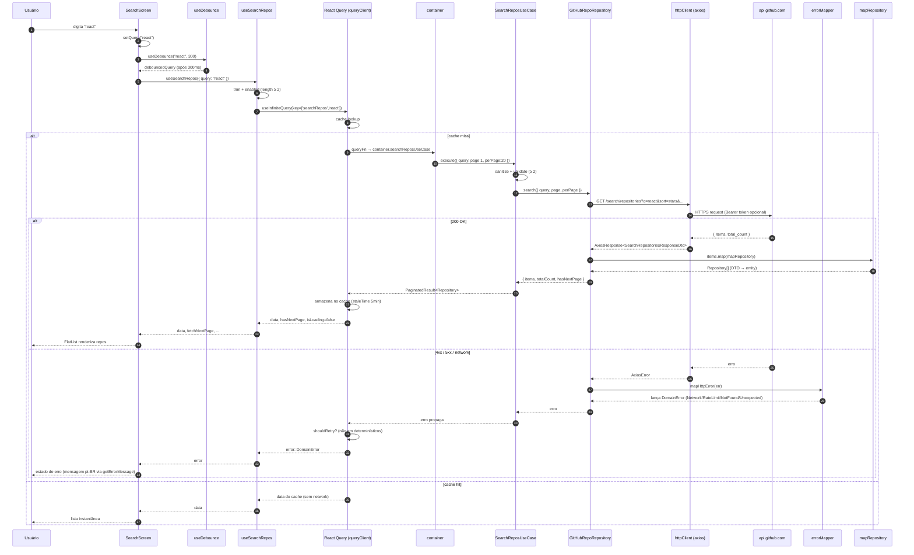

# GitHub Explorer — Documento de Acompanhamento do Projeto

> Documento didático que explica **o que já está implementado**, **por que cada
> peça existe** e **o que ainda falta** para fechar o projeto seguindo Clean
> Architecture. Pensado para quem chega no repo agora e precisa entender em
> profundidade — escrito como aula, não como release notes.

---

## 1. Visão geral do projeto

Aplicativo mobile (Expo SDK 54 + React Native 0.81) que consome a API pública
do GitHub para:

1. Buscar repositórios por termo (com paginação e debounce).
2. Ver detalhes de um repositório (estrelas, forks, watchers, linguagem).
3. Listar issues abertas desse repositório (paginadas).
4. Showcase do design system (todos os componentes + switch de tema).

A meta arquitetural é separar o app em **quatro camadas concêntricas** seguindo
Clean Architecture: `domain → application → infrastructure → presentation`.
Cada camada só pode importar de camadas mais internas (regra travada por
`eslint-plugin-boundaries`).

---

## 2. Stack escolhida (e por quê)

| Camada            | Tecnologia                          | Motivo                                                                    |
| ----------------- | ----------------------------------- | ------------------------------------------------------------------------- |
| Build / Runtime   | Expo SDK 54 (New Architecture)      | DX rápida, OTA via Expo Go, suporte à nova arch nativa do RN              |
| UI                | React Native 0.81 + React 19        | Compatível com SDK 54                                                     |
| Linguagem         | TypeScript 5.9 (`strict`)           | Erros em tempo de compilação, narrowing forte em entidades de domínio     |
| Navegação         | `@react-navigation` v7              | Padrão de mercado; tabs + native-stack                                    |
| Tema / Estilo     | `@shopify/restyle` v2               | Theming tipado em cima do StyleSheet; tokens semânticos                   |
| Data fetching     | `@tanstack/react-query` v5          | Cache, retry, paginação infinita, dedupe sem precisar de Redux            |
| HTTP              | `axios` v1                          | Interceptors limpos, error shape consistente                              |
| Datas             | `date-fns`                          | Modular (tree-shake), locale `pt-BR` plug-and-play                        |
| Ícones            | `lucide-react-native`               | SVG tree-shakeable, integra com `react-native-svg`                        |
| Lint              | ESLint 9 flat config + `boundaries` | Enforcement de Clean Architecture em CI/IDE                               |
| Testes            | Jest + `jest-expo` + RNTL           | Preset Expo já alinhado a SDK; React Native Testing Library para UI       |
| Persistência leve | `AsyncStorage`                      | Theme mode preference                                                     |

---

## 3. Estrutura de pastas (cada camada explicada)

```
src/
├── domain/             # núcleo puro. Zero dependências externas.
│   ├── entities/       # Repository, Issue, Owner, Label
│   ├── repositories/   # contratos (interfaces) — IRepoRepository, IIssueRepository
│   └── errors/         # DomainError + subclasses (RateLimit, NotFound, etc.)
│
├── application/        # orquestra o domain. NUNCA conhece axios, RN, React.
│   └── use-cases/      # SearchRepos, GetRepoDetails, ListIssues
│
├── infrastructure/     # adapters concretos. Pode importar domain + application.
│   ├── http/           # axios client, mappers DTO→entity, error mapper
│   ├── repositories/   # GitHubRepoRepository, GitHubIssueRepository, mocks
│   ├── di/             # container — wire-up de dependências
│   ├── theme/          # Restyle theme (light/dark, fonts, tokens)
│   ├── query/          # QueryClient + QueryProvider (React Query)
│   └── reactotron/     # Reactotron config (debug)
│
└── presentation/       # tudo o que o usuário vê. Pode importar todas as outras.
    ├── navigation/     # RootNavigator, Tabs, Stacks
    ├── screens/        # 4 telas: Search, RepoDetail, Issues, DesignSystem
    ├── components/     # RepoListItem, IssueListItem, EmptyState
    ├── design-system/  # Button, Card, Input, Badge, Avatar, primitives
    ├── hooks/          # useSearchRepos, useRepoDetails, useIssues, useDebounce
    └── utils/          # getErrorMessage, formatRelativeDate
```

A regra de ouro: **a seta da dependência aponta sempre para dentro**.
`presentation` pode falar com `domain`; `domain` jamais com `presentation`.

---

## 4. O que já foi feito — camada por camada

### 4.1. Domain (núcleo do app)

**Conceito:** modela vocabulário do negócio em tipos puros de TypeScript. Sem
React, sem axios, sem nada. Se um dia trocarmos a plataforma (web, CLI), essa
camada vai inteira.

**Entidades** (`src/domain/entities/`):

- `Owner.ts` — dono do repo (`User` ou `Organization`). Campos `id`, `login`,
  `avatarUrl`, `type`.
- `Repository.ts` — repo em si. Campos `stars` (em vez de `stargazers_count`),
  `pushedAt: Date` já convertido, `description: string | null` (modela
  ausência explicitamente).
- `Label.ts` — etiqueta de issue. `color` é hex **sem** `#` (mesma forma da API
  do GitHub).
- `Issue.ts` — issue completa. `author` é `Pick<Owner, 'login' | 'avatarUrl'>`
  — só pega o que importa.

> **Por que `interface` e não `class`?** Entidades são **dados**, não
> comportamento. `interface` deixa claro que é forma, não objeto vivo.

**Repositórios** (`src/domain/repositories/`):

- `Pagination.ts` — tipo genérico `PaginatedResult<T>` reusado nos dois
  contratos. Repare: `totalCount?` é opcional, porque nem todo endpoint da
  GitHub devolve total (issues, por exemplo).
- `IRepoRepository.ts` — `search(params)` e `getDetails(owner, repo)`.
- `IIssueRepository.ts` — `list(params)`.

**Erros** (`src/domain/errors/`):

- `DomainError.ts` — classe abstrata base. Carrega `code: string` discriminador
  para `switch (err.code)` exaustivo. Preserva stack trace em V8/Hermes.
- `NetworkError.ts`, `NotFoundError.ts`, `RateLimitError.ts`,
  `InvalidQueryError.ts`, `UnexpectedError.ts` — cada um com `code` `as const`
  literal.

**Como validar a pureza:**

```bash
grep -rE "^import" src/domain/ | grep -v "@/domain"
```

Saída vazia comprova que `domain` não importa nada externo.

---

### 4.2. Application (use cases)

**Conceito:** cada caso de uso é uma operação de negócio. Recebe um
repositório (interface) por construtor — **inversão de dependência** em prática.
Não sabe se o repo é axios, é mock ou é fetch puro.

**Arquivos** (`src/application/use-cases/`):

#### `SearchReposUseCase.ts`

```ts
async execute(input: SearchReposInput): Promise<PaginatedResult<Repository>> {
  const sanitized = this.sanitize(input.query);  // .trim()
  this.validate(sanitized);                       // >= 2 chars senão InvalidQueryError
  return this.repoRepository.search({
    query: sanitized,
    page: input.page,
    perPage: input.perPage ?? 20,
  });
}
```

Repare em três coisas:

1. **Sanitiza antes de validar.** `"  ab  "` vira `"ab"` antes da checagem de
   tamanho — o usuário não é punido por digitar espaço sem querer.
2. **Default de `perPage` aqui, não no repo.** Use case decide a regra de
   negócio; repo só executa o pedido.
3. **Não trata erro do repo.** Erros sobem direto. Por quê? Porque já são
   `DomainError` (a infrastructure cuidou disso). Use case não tem o que
   melhorar — só repassa.

#### `GetRepoDetailsUseCase.ts`

Trim em `owner` e `repo`, valida ambos não-vazios, chama
`repoRepository.getDetails`. Mesmo princípio.

#### `ListIssuesUseCase.ts`

Default `state ?? 'open'` e `perPage ?? 20`. Tudo no use case, nunca no hook.

---

### 4.3. Infrastructure (adapters concretos)

**Conceito:** cola entre o mundo (HTTP, banco, disco) e o domain. **Toda
dependência externa nasce aqui.**

#### 4.3.1. HTTP layer (`src/infrastructure/http/`)

##### `httpClient.ts`

```ts
export function createHttpClient(): AxiosInstance {
  const client = axios.create({
    baseURL: 'https://api.github.com',
    timeout: 15000,
    headers: {
      Accept: 'application/vnd.github+json',
      'X-GitHub-Api-Version': '2022-11-28',
    },
  });
  const token = process.env.EXPO_PUBLIC_GITHUB_TOKEN;
  if (token !== undefined && token.length > 0) {
    client.interceptors.request.use((config) => {
      config.headers.Authorization = `Bearer ${token}`;
      return config;
    });
  }
  return client;
}
export const httpClient = createHttpClient();
```

Linha por linha:

- `baseURL` fixo para api.github.com. Mudar host = mudar UMA linha.
- `Accept` e `X-GitHub-Api-Version` são padrão recomendado do GitHub — congela
  o contrato em uma versão específica.
- Interceptor só registra Authorization se houver token. Sem token: 60 req/h.
  Com token: 5000 req/h.
- Prefixo `EXPO_PUBLIC_` é obrigatório no Expo — vars sem ele não chegam ao
  bundle JS. **Risco:** o token vira público no bundle, use só `public_repo`.
- `httpClient` exportado como singleton — o mesmo instance é reusado por
  todos os repositórios concretos.

##### `errorMapper.ts`

Função `mapHttpError(err, ctx): never` traduz `AxiosError` em `DomainError`:

```ts
if (!axios.isAxiosError(err)) throw new UnexpectedError();
if (err.response === undefined) throw new NetworkError();
if (isRateLimit(err)) throw new RateLimitError(undefined, parseResetAt(err));
if (err.response.status === 404) throw new NotFoundError(ctx ?? 'Recurso');
throw new UnexpectedError();
```

Pontos didáticos:

- **Retorno `never`.** O TS entende que a função sempre lança. Caller fica
  `try { ... } catch (e) { mapHttpError(e); }` sem precisar de `return`.
- **Rate limit detectado por dois caminhos.** Status 429 (abuse) OU status 403
  com header `x-ratelimit-remaining=0` (limite primário). É como o GitHub
  sinaliza.
- **`parseResetAt`** lê `x-ratelimit-reset` (unix em segundos) e devolve
  `Date` — o erro carrega isso pra UI mostrar "tente em X minutos".

##### DTOs e mappers

DTOs (`dtos/RepositoryDto.ts`, `dtos/IssueDto.ts`) modelam o shape **bruto** do
GitHub: snake_case (`stargazers_count`, `created_at`), aninhamentos exatos.

Mappers (`mappers/repositoryMapper.ts`, `mappers/issueMapper.ts`) traduzem
DTO → entity:

```ts
export function mapRepository(dto: RepositoryDto): Repository {
  return {
    id: dto.id,
    name: dto.name,
    fullName: dto.full_name,            // snake → camel
    owner: mapOwner(dto.owner),
    description: dto.description,
    stars: dto.stargazers_count,        // renomeia vocabulário
    forks: dto.forks_count,
    watchers: dto.watchers_count,
    openIssuesCount: dto.open_issues_count,
    language: dto.language,
    htmlUrl: dto.html_url,
    pushedAt: new Date(dto.pushed_at),  // string ISO → Date
  };
}
```

Por que essa separação? **Trocar a API (REST → GraphQL, ou outro provedor)
mexe só em DTO + mapper.** O domain não percebe.

#### 4.3.2. Repositories (`src/infrastructure/repositories/`)

##### `GitHubRepoRepository.ts`

Implementa `IRepoRepository` contra `/search/repositories` e
`/repos/{owner}/{repo}`. Bloco-chave:

```ts
async search({ query, page, perPage }) {
  try {
    const response = await httpClient.get<SearchRepositoriesResponseDto>(
      '/search/repositories',
      { params: { q: query, sort: 'stars', order: 'desc', page, per_page: perPage } },
    );
    const items = response.data.items.map(mapRepository);
    const totalCount = response.data.total_count;
    const hasNextPage = page * perPage < totalCount;
    return { items, totalCount, hasNextPage };
  } catch (err) {
    mapHttpError(err);
  }
}
```

- `sort=stars&order=desc` é decisão de produto — vem aqui porque é forma do
  request, não regra de domínio.
- `hasNextPage = page * perPage < totalCount` é matemática simples: se a
  página 8 com 20 itens chegaria em 160 mas o total é 150, não há próxima.

##### `GitHubIssueRepository.ts`

Difere em duas coisas importantes:

1. **API de issues NÃO devolve `total_count`.** Heurística:
   `hasNextPage = response.data.length === perPage`. Página cheia =
   provavelmente há mais. Documentado em comentário no arquivo.
2. **API mistura PRs com issues** (decisão histórica do GitHub). Filtro em
   runtime: `data.filter((dto) => !('pull_request' in dto))`.

##### Mocks (`InMemoryRepoRepository.ts`, `InMemoryIssueRepository.ts`)

Implementam as mesmas interfaces com dados de fixture. Servem pra:

- Desenvolver UI sem queimar rate limit.
- Testar telas com payload determinístico.
- Provar que a abstração funciona (mesma tela, mesma renderização, dado
  diferente).

#### 4.3.3. DI Container (`src/infrastructure/di/container.ts`)

Único ponto do app que monta dependências:

```ts
const USE_MOCK = process.env.EXPO_PUBLIC_USE_MOCK !== 'false';

function buildRepoRepository(): IRepoRepository {
  if (USE_MOCK) return new InMemoryRepoRepository();
  return new GitHubRepoRepository();
}
function buildIssueRepository(): IIssueRepository {
  if (USE_MOCK) return new InMemoryIssueRepository();
  return new GitHubIssueRepository();
}

const repoRepository = buildRepoRepository();
const issueRepository = buildIssueRepository();

export const container = {
  searchReposUseCase: new SearchReposUseCase(repoRepository),
  getRepoDetailsUseCase: new GetRepoDetailsUseCase(repoRepository),
  listIssuesUseCase: new ListIssuesUseCase(issueRepository),
} as const;
```

- Feature flag `EXPO_PUBLIC_USE_MOCK` controla mock vs HTTP em **um** ponto.
- Use cases recebem o repo por construtor — não sabem qual é a implementação.
- `as const` congela a forma do container (autocomplete tipado em quem
  consome).

#### 4.3.4. Theme (`src/infrastructure/theme/`)

- `lightTheme.ts` / `darkTheme.ts` — token-based via Restyle (colors, spacing,
  textVariants, buttonVariants).
- `tokens/palette.ts` — paleta crua (escala neutra + accent).
- `AppThemeProvider.tsx` — Context que resolve `mode` (`light` | `dark` |
  `system`) via `useColorScheme` do RN, persiste em AsyncStorage.
- `fonts.ts` — `useAppFonts()` (Expo Google Fonts: Geist + Geist Mono).
- `languageColors.ts` — mapa fixo nome-linguagem → cor (mesmo padrão do
  github/linguist).

> Bug notório resolvido na etapa 6A: `app.json.userInterfaceStyle: "light"`
> trava o `useColorScheme` em light. Trocado para `"automatic"`. Doc em
> `docs/README.md` (seção Troubleshooting).

#### 4.3.5. Query (`src/infrastructure/query/`)

`queryClient.ts`:

```ts
function shouldRetry(failureCount: number, error: unknown): boolean {
  if (error instanceof RateLimitError) return false;
  if (error instanceof InvalidQueryError) return false;
  if (error instanceof NotFoundError) return false;
  return failureCount < 1;
}

export const queryClient = new QueryClient({
  defaultOptions: {
    queries: {
      staleTime: 5 * 60 * 1000,
      gcTime: 30 * 1000,
      retry: shouldRetry,
      refetchOnWindowFocus: false,
    },
  },
});
```

- **Smart retry.** Erros determinísticos (rate limit, query inválida, 404)
  não retentam — nova tentativa só queima rate limit.
- **`refetchOnWindowFocus: false`.** Padrão React Query é desktop-first. Em
  mobile, "voltar pro app" não deve disparar request silencioso.
- **`staleTime: 5min`** + **`gcTime: 30s`.** Cache acessível por 5 min sem
  refetch; coletado 30s após não ter consumer.

---

### 4.4. Presentation (UI)

#### 4.4.1. Navigation (`src/presentation/navigation/`)

- `RootNavigator.tsx` — `NavigationContainer` + tema dinâmico (light/dark).
- `TabsNavigator.tsx` — bottom tabs: **Explore** e **Design System**.
- `ExploreStack.tsx` — Search → RepoDetail → Issues.
- `DesignSystemStack.tsx` — única tela DesignSystem (stack mantida pra header
  consistente).
- `types.ts` — tipos `ScreenProps` por stack, ligados em
  `RootParamList`.

Detalhe técnico: `headerBackButtonDisplayMode: 'minimal'` (API nova v7;
`headerBackTitleVisible` saiu).

#### 4.4.2. Hooks (`src/presentation/hooks/`)

##### `useSearchRepos.ts`

```ts
export function useSearchRepos({ query }: UseSearchReposParams) {
  const trimmedQuery = query.trim();
  const enabled = trimmedQuery.length >= 2;
  return useInfiniteQuery({
    queryKey: ['searchRepos', trimmedQuery],
    queryFn: ({ pageParam }) =>
      container.searchReposUseCase.execute({
        query: trimmedQuery, page: pageParam, perPage: 20,
      }),
    initialPageParam: 1,
    getNextPageParam: (lastPage, allPages) =>
      lastPage.hasNextPage ? allPages.length + 1 : undefined,
    enabled,
  });
}
```

- Hook **só adapta** o use case ao ciclo de vida do React Query — não faz
  validação própria (a do use case é a fonte da verdade).
- `enabled` evita request com query curta. Use case ainda valida no servidor
  pra defesa em profundidade.
- `getNextPageParam: undefined` faz `hasNextPage` virar `false` automático.

##### `useRepoDetails.ts` / `useIssues.ts`

Mesmo padrão. `useIssues` aceita `state` (default `'open'`).

##### `useDebounce.ts`

Hook genérico `useDebounce<T>(value, delay)`. Usa `setTimeout` + cleanup. Usado
no SearchScreen com 300ms.

#### 4.4.3. Utils (`src/presentation/utils/`)

##### `getErrorMessage.ts`

Função **pura** (sem hook, sem state). Casa `error instanceof X` e devolve
string pt-BR. Pode ser chamada em qualquer lugar — render, callback, top-level.

##### `formatRelativeDate.ts`

Wrapper de uma linha sobre `formatDistanceToNow` do date-fns com locale
`ptBR`. Isolar a lib custou 5 linhas e protege todo o resto do app de uma
troca futura.

#### 4.4.4. Design System (`src/presentation/design-system/`)

- **Primitives** (`primitives/`):
  - `Box.ts` — `createBox<Theme>()` do Restyle. Aceita props de spacing,
    color, layout.
  - `Text.ts` — `createText<Theme>()` com `variant` ligada a `textVariants`.
  - `Pill.tsx`, `LanguageDot.tsx`, `Spinner.tsx`.

- **Componentes**:
  - `Button.tsx` — variants (`primary`/`secondary`/`outline`/`ghost`), sizes,
    `loading`, `disabled`. Usa `ButtonBox` criado via
    `createRestyleComponent + createVariant` (porque `createBox` não suporta
    `variant`).
  - `Card.tsx` — mesmo padrão (`CardBox`).
  - `Input.tsx`, `Badge.tsx`, `Avatar.tsx`.

> Descoberta importante (etapa 6B): `createBox` cobre layout primitivo, mas
> theme `variant` **só funciona** com `createRestyleComponent + createVariant`.

#### 4.4.5. Components (`src/presentation/components/`)

- `RepoListItem.tsx` — card de repo (Avatar, Star, LanguageDot, Fork).
- `IssueListItem.tsx` — card de issue (título, badges de labels coloridos,
  número, data relativa).
- `EmptyState.tsx` — estado vazio reusável.

#### 4.4.6. Screens (`src/presentation/screens/`)

Todas as 4 telas seguem o **mesmo pattern de state machine**:

```
queryHasMinLength ? loading ? error ? empty ? lista
```

Cada return é mais específico que o seguinte. UX consistente: header fixo no
topo + corpo variável.

- **`SearchScreen.tsx`** — Input com debounce 300ms + FlatList infinita +
  pull-to-refresh + 5 estados. Distingue `isFetching && !isFetchingNextPage`
  (refresh do topo) de `isFetchingNextPage` (próxima página).
- **`RepoDetailScreen.tsx`** — Hero (avatar/nome/desc) + StatsGrid (3 colunas
  flex=1) + RepoMeta + CTA pra Issues. ScrollView simples (conteúdo fixo).
- **`IssuesScreen.tsx`** — FlatList paginada de issues abertas. Mesmo pattern
  do SearchScreen.
- **`DesignSystemScreen.tsx`** — Showcase com 9 seções (ThemeMode,
  Typography, Buttons, Inputs, Badges, Cards, Avatars, Primitives,
  ColorTokens). Switch primary/outline para alternar tema. Cor dos swatches
  vem de `keyof Theme['colors']` — mexer no tema atualiza a showcase
  automaticamente.

#### 4.4.7. App.tsx (entry point)

```tsx
return (
  <QueryProvider>
    <AppThemeProvider>
      <RootNavigator />
      <StatusBar style="auto" />
    </AppThemeProvider>
  </QueryProvider>
);
```

Ordem dos providers importa: **Query > Theme > Nav**. Qualquer hook em
qualquer nível pode chamar `useQuery` sem se preocupar com mount order.
Splash screen segura até as fontes carregarem (`useAppFonts`).

---

## 5. Como rodar o projeto

```bash
# 1. clonar e instalar
pnpm install

# 2. configurar env (opcional pra HTTP real)
cp .env.example .env
# editar EXPO_PUBLIC_USE_MOCK=false pra usar API real
# editar EXPO_PUBLIC_GITHUB_TOKEN=<seu_PAT> pra subir rate limit pra 5000/h

# 3. rodar
pnpm start          # Metro
pnpm ios            # simulador iOS
pnpm android        # emulador Android

# 4. validações
pnpm typecheck      # tsc --noEmit (zero erros)
pnpm lint           # eslint (zero errors, warnings aceitos)
pnpm test           # jest
```

---

## 6. O que falta para finalizar o projeto

> Status corrigido após auditoria do código. O item "HTTP real" foi
> **concluído na Etapa 12** (`GitHubRepoRepository` + `GitHubIssueRepository`
> instanciados via `container.ts` quando `EXPO_PUBLIC_USE_MOCK=false`).

### 6.1. ✅ Já feito (resumo executivo)

- [x] Bootstrap Expo SDK 54 + RN 0.81 + TS strict + path aliases
- [x] ESLint flat + `boundaries` + `import` + resolver TypeScript
- [x] Prettier + Jest + RNTL configurados
- [x] **Domain completo** — entities, repository interfaces, errors
- [x] **Application completa** — 3 use cases (Search, Detail, ListIssues)
- [x] **Infrastructure completa** — theme (light/dark), DI, http client,
      error mapper, DTOs, mappers, mocks E implementação HTTP real
- [x] **Presentation completa** — navigation, hooks React Query, design
      system, 4 telas reais validadas visualmente (light + dark)
- [x] AsyncStorage persistindo theme mode
- [x] Reactotron config
- [x] `.env.example` documentado
- [x] `AI_USAGE.md` com decisões por etapa

### 6.2. ⏳ Pendente para fechar o projeto

#### 6.2.1. Testes (CRÍTICO — pastas vazias)

`__tests__/{domain,application,presentation}` existem mas estão **vazias**.
Precisa cobrir no mínimo:

- **Domain** (`__tests__/domain/`):
  - `errors/DomainError.test.ts` — instancia subclasses, valida `code`,
    valida `name`, valida herança.
  - Opcional: validar shape de entities (em strict TS já é compile-time).

- **Application** (`__tests__/application/`) — **maior valor de teste**:
  - `SearchReposUseCase.test.ts` — sanitização de query, validação de
    `< 2 chars`, default de `perPage`, propagação de erro do repo.
  - `GetRepoDetailsUseCase.test.ts` — trim de owner/repo, erro em vazio.
  - `ListIssuesUseCase.test.ts` — default de `state`, default de `perPage`.
  - **Use repositórios fake** (objeto literal implementando a interface) —
    não precisa de mock framework.

- **Presentation** (`__tests__/presentation/`):
  - `utils/getErrorMessage.test.ts` — uma asserção por subtipo de erro.
  - Opcional: `hooks/useDebounce.test.ts` com `jest.useFakeTimers`.

> Stack já está plugada (`jest-expo` + RNTL). Falta só escrever os arquivos.

#### 6.2.2. Polish de UX

- **Estados extras** ainda ausentes:
  - Skeleton loader (em vez de Spinner) durante isLoading inicial — mais
    refinado em listas longas.
  - Toast / banner pra `RateLimitError` mostrando `resetAt` formatado.
  - Retry button explícito no estado de erro (hoje só pull-to-refresh).
- **Animações** (opcional, se houver tempo):
  - `LayoutAnimation` ou `react-native-reanimated` no aparecer/sumir de
    items do FlatList.
  - Transição suave entre Search → RepoDetail (já vem do native-stack,
    talvez ajustar `animation: 'slide_from_right'`).
- **Acessibilidade**:
  - `accessibilityLabel` nos Pressables principais.
  - Touch targets ≥ 44pt (auditoria visual no Inspector).

#### 6.2.3. README final

`README.md` na raiz hoje é **placeholder**. Deve conter:

- Descrição curta do projeto.
- Screenshots (light + dark) das 4 telas.
- Stack (link para `docs/PROJETO.md` para detalhes).
- Como rodar (3 comandos).
- Variáveis de ambiente.
- Decisões arquiteturais resumidas (link para `docs/PROJETO.md` e
  `docs/domain.md`).
- "O que faria diferente com mais tempo" — bullet list honesta.

#### 6.2.4. Limpeza

- **`mockups/`** — pasta com HTML standalone do Octolens. Não é consumida
  por nenhum código de produção. Decisões:
  - Opção A: deletar (ficou histórico no git).
  - Opção B: mover para `docs/mockups/` se quiser manter como referência
    visual.
- **`AI_USAGE.md`** — hoje é cronológico (etapa 1, 2, 3...). Organizar:
  - Seção "Decisões arquiteturais" no topo.
  - Seção "Etapas" depois.
  - Seção "Aprendizados / surpresas".
- **`docs/README.md`** — desatualizado em alguns pontos (lista de "Próximos
  passos" cita itens já feitos). Reorganizar pra ser doc de **setup**
  apenas, com link pra `PROJETO.md` pro status completo.
- **`docs/domain.md`** — bem escrito, manter. Atualizar a tabela de erros
  para incluir `InvalidQueryError` (criada depois).

#### 6.2.5. Migração técnica (deferred — registrado em `AI_USAGE.md`)

- `eslint-plugin-boundaries` v5 → v6 (consolida regras em
  `boundaries/dependencies`). Hoje gera warnings de deprecation; funciona,
  mas precisa ser feito antes de qualquer mudança maior no eslint config.

---

## 7. Ordem sugerida para fechar

1. **Testes de application** — maior valor pelo menor custo. ~1-2h.
2. **README final na raiz** — porta de entrada do projeto. ~30min.
3. **Limpeza de docs e mockups** — coerência geral. ~30min.
4. **Polish de UX** (toast de erro, retry button) — refinamento. ~1h.
5. **Migração eslint v6** (opcional) — só se sobrar tempo. ~1h.

Soma ~4h. Tudo verificável via `pnpm typecheck && pnpm lint && pnpm test`.

---

## 8. Prova viva da Clean Architecture

A coisa mais bonita do projeto: trocar mocks por HTTP real foi literalmente
**duas linhas em `container.ts`**:

```diff
- if (USE_MOCK) return new InMemoryRepoRepository();
+ if (USE_MOCK) return new InMemoryRepoRepository();
+ return new GitHubRepoRepository();
```

Nenhuma tela mudou. Nenhum hook mudou. Nenhum use case mudou. Nenhum entity
mudou. O git diff da etapa 12 fica 100% confinado em `src/infrastructure/**`.

Isso é o teste de fogo da abstração: se você consegue trocar o backend sem
tocar em UI ou regra de negócio, a arquitetura está funcionando. Aqui está.

---

## 9. Mapa visual — quem chama quem

> Esta seção responde à pergunta "tá desacoplado demais, como eu vejo o fluxo?".
> São três diagramas (Mermaid renderiza nativo no GitHub):
>
> 1. **Responsabilidades** — o que o app precisa fazer, agrupado por intenção.
> 2. **Arquitetura em camadas** — todos os módulos, dependências, e o que falta.
> 3. **Fluxo de uma busca** — sequência ponta-a-ponta de um caractere digitado
>    até a lista renderizada.

### 9.1. Responsabilidades (mapa mental)

Pensa nisso como o "Login" do diagrama clássico de Clean Architecture, mas
adaptado pro nosso domínio: **explorar repositórios do GitHub**. Cada folha é
uma responsabilidade discreta que vive em UMA camada específica.

```mermaid
mindmap
  root((Explorar Repos))
    Apresentação
      Renderizar lista
      Estado UI: loading / error / empty / list
      Debounce de input (300ms)
      Pull-to-refresh
      Paginação infinita (scroll)
      Navegação Search → Detail → Issues
      Tema light / dark
    Regras de Negócio
      Sanitizar query (trim)
      Validar tamanho mínimo (≥ 2 chars)
      Default perPage = 20
      Default state issues = open
      Ordenação stars desc
    Estado e Cache
      Cache por queryKey
      Dedupe de requests
      Stale time 5 min
      Retry só em transientes
    Comunicação com API
      HTTP GET /search/repositories
      HTTP GET /repos/{owner}/{repo}
      HTTP GET /repos/{owner}/{repo}/issues
      Auth via Bearer token (opcional)
      Versão pinada da API (2022-11-28)
    Tratamento de Erros
      Mapear AxiosError → DomainError
      Rate limit (429 ou header)
      Network down
      404 not found
      Query inválida
      Mensagem pt-BR no UI
    Mock / Real
      Feature flag EXPO_PUBLIC_USE_MOCK
      Mesma interface IRepoRepository
      Fixtures determinísticas
```

Cada folha mora exatamente em UM lugar:

| Responsabilidade               | Camada            | Arquivo principal                        |
| ------------------------------ | ----------------- | ---------------------------------------- |
| Renderizar lista               | presentation      | `SearchScreen.tsx`                       |
| Debounce                       | presentation/hook | `useDebounce.ts`                         |
| Sanitizar + validar query      | application       | `SearchReposUseCase.ts`                  |
| Default `perPage`              | application       | `SearchReposUseCase.ts`                  |
| Ordenação stars desc           | infrastructure    | `GitHubRepoRepository.ts` (param HTTP)   |
| Cache, retry, dedupe           | infrastructure/q  | `queryClient.ts`                         |
| Map Axios → DomainError        | infrastructure    | `errorMapper.ts`                         |
| Mensagem pt-BR                 | presentation/util | `getErrorMessage.ts`                     |
| Mock vs HTTP real              | infrastructure/di | `container.ts`                           |

Se algum item dessa tabela aparecer em outro lugar, vazou de camada — é o sinal
pra refatorar.

### 9.2. Arquitetura em camadas (módulos e dependências)

Réplica do diagrama de baixo do print, adaptada à nossa stack. Setas apontam
**para dentro** (na direção da dependência). Caixas tracejadas são interfaces
do domain — quem implementa não é amarrado pelo nome, é amarrado pelo contrato.

```mermaid
flowchart TB
    classDef domain fill:#cdeefd,stroke:#2c7da0,color:#000
    classDef app fill:#d9f3d4,stroke:#2d6a4f,color:#000
    classDef infra fill:#fde2e4,stroke:#a4133c,color:#000
    classDef present fill:#e7d6f7,stroke:#5a189a,color:#000
    classDef main fill:#fdebd0,stroke:#b08968,color:#000
    classDef external fill:#dddddd,stroke:#555,color:#000
    classDef pending fill:#fff3b0,stroke:#bb9900,color:#000,stroke-dasharray: 5 5

    %% ─────────── External ───────────
    GH[(api.github.com)]:::external
    AX[axios]:::external
    RQ[TanStack Query v5]:::external
    AS[(AsyncStorage)]:::external
    NAV[React Navigation v7]:::external

    %% ─────────── Domain ───────────
    subgraph Domain["DOMAIN (núcleo, zero deps externas)"]
        direction TB
        ENT["Entities<br/>Repository · Issue · Owner · Label"]:::domain
        IREPO[/"IRepoRepository<br/>(interface)"/]:::domain
        IISSUE[/"IIssueRepository<br/>(interface)"/]:::domain
        ERR["Errors<br/>DomainError · NetworkError · RateLimit ·<br/>NotFound · InvalidQuery · Unexpected"]:::domain
        PAG["PaginatedResult&lt;T&gt;"]:::domain
    end

    %% ─────────── Application ───────────
    subgraph Application["APPLICATION (use cases)"]
        direction TB
        UC1["SearchReposUseCase"]:::app
        UC2["GetRepoDetailsUseCase"]:::app
        UC3["ListIssuesUseCase"]:::app
        UC4["CountOpenIssuesUseCase"]:::app
    end

    %% ─────────── Infrastructure ───────────
    subgraph Infrastructure["INFRASTRUCTURE (adapters)"]
        direction TB
        HTTP["httpClient<br/>(axios singleton)"]:::infra
        EMAP["errorMapper<br/>Axios → DomainError"]:::infra
        DTO["DTOs<br/>RepositoryDto · IssueDto"]:::infra
        MAP["Mappers<br/>DTO → entity"]:::infra
        GHRR["GitHubRepoRepository"]:::infra
        GHIR["GitHubIssueRepository"]:::infra
        MOCKR["InMemoryRepoRepository"]:::infra
        MOCKI["InMemoryIssueRepository"]:::infra
        QC["queryClient<br/>(staleTime / retry / gcTime)"]:::infra
        QP["QueryProvider"]:::infra
        THEME["Theme (Restyle)<br/>light/dark + tokens"]:::infra
        THSTOR["themeStorage<br/>(AsyncStorage)"]:::infra
        FONTS["fonts (Geist)"]:::infra
        RTRON["Reactotron"]:::infra
    end

    %% ─────────── Presentation ───────────
    subgraph Presentation["PRESENTATION (UI)"]
        direction TB
        SC1["SearchScreen"]:::present
        SC2["RepoDetailScreen"]:::present
        SC3["IssuesScreen"]:::present
        SC4["DesignSystemScreen"]:::present
        H1["useSearchRepos"]:::present
        H2["useRepoDetails"]:::present
        H3["useIssues"]:::present
        H4["useOpenIssuesCount"]:::present
        H5["useDebounce"]:::present
        DS["Design System<br/>Button · Card · Input · Badge ·<br/>Avatar · Box · Text · Pill"]:::present
        CMP["Components<br/>RepoListItem · IssueListItem · EmptyState"]:::present
        UTIL["Utils<br/>getErrorMessage · formatRelativeDate"]:::present
        NAVCFG["Navigation<br/>RootNavigator · Tabs · Stacks"]:::present
    end

    %% ─────────── Main / Composition Root ───────────
    subgraph Main["MAIN (composition root)"]
        direction TB
        DI["container.ts<br/>flag EXPO_PUBLIC_USE_MOCK"]:::main
        APP["App.tsx<br/>QueryProvider › ThemeProvider › RootNavigator"]:::main
    end

    %% ─────────── Pendente (futuro) ───────────
    subgraph Pendente["A IMPLEMENTAR"]
        direction TB
        T1["__tests__/domain<br/>DomainError"]:::pending
        T2["__tests__/application<br/>SearchRepos · GetRepoDetails · ListIssues"]:::pending
        T3["__tests__/presentation<br/>getErrorMessage · useDebounce"]:::pending
        UX1["Toast / Banner<br/>RateLimitError + resetAt"]:::pending
        UX2["Skeleton loader"]:::pending
        UX3["Retry button explícito"]:::pending
        UX4["A11y labels + touch ≥ 44pt"]:::pending
        README["README raiz<br/>(screenshots, setup)"]:::pending
        LINT["ESLint boundaries v5 → v6"]:::pending
    end

    %% ─────────── Dependências (setas apontam para dentro) ───────────
    %% application → domain
    UC1 --> IREPO
    UC1 --> ENT
    UC1 --> ERR
    UC2 --> IREPO
    UC2 --> ENT
    UC3 --> IISSUE
    UC3 --> ENT
    UC4 --> IISSUE

    %% infrastructure → domain + application
    GHRR -.implements.-> IREPO
    GHIR -.implements.-> IISSUE
    MOCKR -.implements.-> IREPO
    MOCKI -.implements.-> IISSUE
    GHRR --> HTTP
    GHRR --> MAP
    GHRR --> EMAP
    GHIR --> HTTP
    GHIR --> MAP
    GHIR --> EMAP
    MAP --> DTO
    MAP --> ENT
    EMAP --> ERR
    HTTP --> AX
    AX --> GH
    QC --> ERR
    QP --> QC
    QP --> RQ
    THSTOR --> AS

    %% presentation → application (via container) + infrastructure
    SC1 --> H1
    SC1 --> CMP
    SC1 --> DS
    SC1 --> UTIL
    SC1 --> H5
    SC2 --> H2
    SC2 --> H4
    SC2 --> DS
    SC3 --> H3
    SC3 --> CMP
    SC3 --> DS
    SC4 --> DS
    H1 --> RQ
    H2 --> RQ
    H3 --> RQ
    H4 --> RQ
    H1 -.via container.-> UC1
    H2 -.via container.-> UC2
    H3 -.via container.-> UC3
    H4 -.via container.-> UC4
    UTIL --> ERR
    DS --> THEME
    NAVCFG --> NAV

    %% main wire-up
    DI --> UC1
    DI --> UC2
    DI --> UC3
    DI --> UC4
    DI --> GHRR
    DI --> GHIR
    DI --> MOCKR
    DI --> MOCKI
    APP --> QP
    APP --> THEME
    APP --> NAVCFG
    APP --> FONTS
    APP --> RTRON

    %% pendente → onde vai conectar
    T2 -.cobre.-> UC1
    T2 -.cobre.-> UC2
    T2 -.cobre.-> UC3
    T3 -.cobre.-> UTIL
    T3 -.cobre.-> H5
    T1 -.cobre.-> ERR
    UX1 -.consome.-> ERR
    UX1 -.exibido em.-> SC1
    UX2 -.substitui Spinner em.-> SC1
    UX3 -.adicionado em.-> SC1
    UX4 -.aplicado em.-> DS
```



#### Leitura do diagrama (resumo das decisões)

1. **Setas só apontam pra dentro.** Presentation conhece application;
   application conhece domain; domain não conhece ninguém. Isso é o que
   `eslint-plugin-boundaries` trava em CI.
2. **Caixas tracejadas com `/.../`** são interfaces do domain. As setas
   `-.implements.->` mostram que `GitHubRepoRepository` e
   `InMemoryRepoRepository` cumprem o **mesmo contrato** — por isso o swap
   mock ↔ real custa zero refactor.
3. **`container.ts` é o único nó que conhece todos.** É o "Composition Root"
   — onde os grafos de objetos são montados. Resto do app só conhece a
   interface.
4. **`QueryClient` mora em `infrastructure/query`**, não em presentation.
   Razão: cache + retry policy é uma decisão de infraestrutura (como se fala
   com o servidor), não de UI. UI só consome via hooks.
5. **Hooks de presentation NÃO chamam axios diretamente.** A linha
   `H1 -.via container.-> UC1` é o coração: o hook pede pro container, o
   container devolve um use case, o use case usa a interface. Nenhuma tela
   importa `httpClient` em lugar nenhum (grep prova).
6. **Theme tem dois caminhos:** os componentes leem tokens via Restyle
   (`DS --> THEME`), e o `themeStorage` persiste a preferência em
   AsyncStorage. UI nunca toca AsyncStorage direto.
7. **Caixas tracejadas amarelas (`A IMPLEMENTAR`)** mostram onde os
   pendentes vão se plugar — sem nascer dependência reversa.

### 9.3. Fluxo ponta-a-ponta de uma busca

"Usuário digita `r` no Input → o que acontece até a lista renderizar?" Resposta
visual (cache miss; segunda digitação repetida é cache hit e o React Query
retorna direto do client):



#### Decisões visíveis no fluxo

- **Debounce na presentation, validação na application.** O debounce é UX
  (não bater na API a cada keystroke); o `length ≥ 2` é regra de negócio
  (busca de 1 char é ruído). Duas camadas, duas razões — não duplicam.
- **`queryKey` inclui o termo.** `['searchRepos', 'react']` ≠
  `['searchRepos', 'redux']`. Cada termo tem cache próprio. Trocar de
  volta pra `'react'` vira cache hit instantâneo (se dentro de 5 min).
- **Erro nunca atravessa camada cru.** O `AxiosError` morre no
  `errorMapper`; o que sobe é sempre um `DomainError` tipado. UI faz
  `instanceof` com segurança.
- **O hook é fino de propósito.** `useSearchRepos` tem ~15 linhas e zero
  regra. Toda a inteligência mora no use case — porque queremos que essa
  regra seja testável **sem** montar um React tree.

### 9.4. Como esse mapa muda quando os pendentes entrarem

| Pendente                       | Camada onde nasce      | Conecta com                                 |
| ------------------------------ | ---------------------- | ------------------------------------------- |
| Testes de use case             | `__tests__/application`| Fakes de `IRepoRepository`/`IIssueRepository`|
| Testes de utils                | `__tests__/presentation`| `getErrorMessage`, `useDebounce`           |
| Toast de RateLimit             | presentation/components | Consome `RateLimitError.resetAt`            |
| Skeleton loader                | presentation/design-system | Substitui Spinner em `isLoading`         |
| Retry button                   | presentation/screens   | Chama `refetch()` do hook                   |
| README raiz                    | repo root              | Linka para `docs/PROJETO.md`                |
| boundaries v5 → v6             | eslint config          | Não afeta runtime                           |

Repare: **nenhum pendente nasce no domain**. Domain está fechado pra negócio
atual. Isso é sinal saudável — a regra de negócio já está modelada; o que
resta é cobertura de testes e refinamento de UX.

---

## 10. Glossário rápido (para colar na cabeça)

| Termo                 | Em uma frase                                                                |
| --------------------- | --------------------------------------------------------------------------- |
| **Entity**            | Tipo do domínio, dado puro, sem comportamento (`Repository`, `Issue`).      |
| **Use Case**          | Operação de negócio. Recebe interfaces, devolve entities ou lança `DomainError`. |
| **Repository (iface)**| Contrato no domain dizendo "alguém sabe buscar X". Não diz como.            |
| **Repository (impl)** | Classe na infrastructure que cumpre o contrato com axios, in-memory, etc.   |
| **DTO**               | Shape **bruto** vindo da API (snake_case, ISO strings).                     |
| **Mapper**            | Função pura DTO → Entity. Onde a tradução de vocabulário acontece.          |
| **Composition Root**  | `container.ts` — único lugar que faz `new GitHubRepoRepository()`.          |
| **QueryClient**       | Cache global do React Query. Define stale/retry/gc para toda query do app.  |
| **queryKey**          | Identificador único da query no cache. Mudou → request novo; igual → reusa. |
| **DomainError**       | Erro tipado que UI consegue tratar. Tudo que sobe pra cima é dessa família. |
